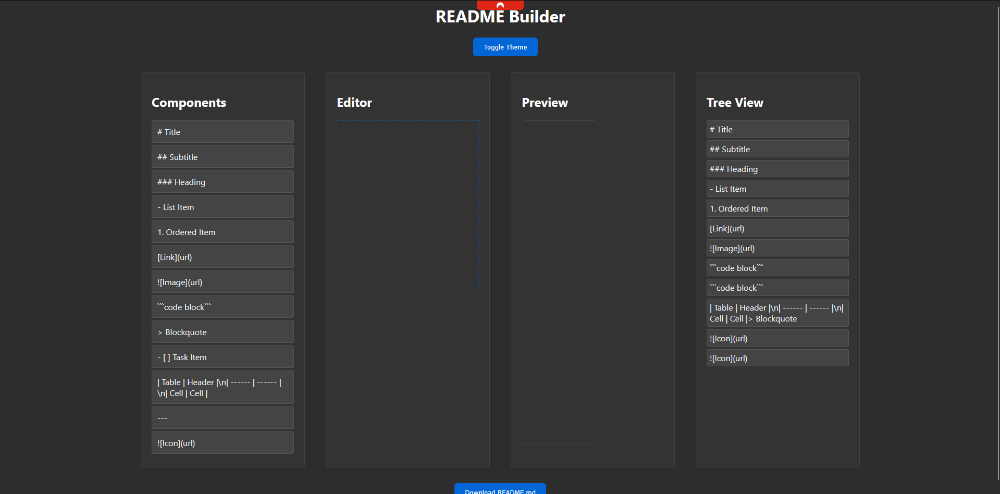

# README Builder

A Website for building README files by dragging and dropping components. This tool allows you to quickly and easily create comprehensive, well-structured README files for your projects.



## Features

- **Drag and Drop Components**: Easily add components like titles, subtitles, lists, links, images, code blocks, blockquotes, tables, badges, footnotes, and more by dragging and dropping.
- **Real-Time Preview**: See how your README will look in real-time as you build it.
- **Tree View**: View the structure of your README file in a hierarchical tree view.
- **Theme Toggle**: Switch between dark mode and light mode to match GitHub's appearance.
- **Component Popups**: Gather information for components like images, links, etc., with ease using popups.
- **Syntax Highlighting**: Enhance code snippets with syntax highlighting.

## Getting Started

1. Clone this repository:
   ```bash
   git clone https://github.com/nettanvirdev/readme-builder.git
   ```

2. Open the `index.html` file in your browser to start using the README Builder.

## How to Use

1. **Add Components**: Drag and drop components from the left sidebar into the editor.
2. **Edit Content**: Click on the components in the editor to edit their content.
3. **Preview**: The preview section on the right shows how your README will look in real-time.
4. **Tree View**: The tree view section displays the structure of your README file.
5. **Download**: Click the "Download README.md" button to download your completed README file.

## Tips and Tricks

- **Using Links**: Click the link component to open a popup where you can enter the link text and URL.
- **Adding Images**: Click the image component to open a popup where you can enter the image alt text and URL.
- **Adding Badges**: Click the badge component to open a popup where you can enter the badge alt text and URL.
- **Footnotes**: Click the footnote component to add footnotes.
- **Table of Contents**: Use the Table of Contents component to automatically generate a table of contents for your README.
- **Icon Picker**: Use the icon picker to add Font Awesome icons to your README.

## TODO

### Components

- [ ] **More Components**: Add more components like badges, tables of contents, and more.
- [ ] **Custom Styling**: Allow users to customize the styling of their README components (colors, fonts, etc.).
- [ ] **Templates**: Provide pre-made templates for different types of projects (e.g., libraries, applications, documentation).

### User Interface

- [ ] **Resizable Editor and Preview**: Make the editor and preview sections resizable.
- [ ] **Drag and Drop Reordering**: Enable reordering of components within the editor via drag and drop.
  
### Collaboration

- [ ] **Collaborative Editing**: Enable multiple users to edit the README file simultaneously.
- [ ] **Commenting System**: Implement a system for users to leave comments on specific sections of the README.

### Export Options

- [ ] **PDF Export**: Add an option to export the README in PDF format.
- [ ] **HTML Export**: Add an option to export the README in HTML format.

### Performance

- [ ] **Optimized Rendering**: Optimize the rendering performance for large README files.
- [ ] **Offline Support**: Ensure the application works seamlessly offline.

## Contributing

We welcome contributions from the community! If you'd like to contribute, please fork the repository and submit a pull request.

## License

This project is licensed under the CC0 1.0 Universal (CC0 1.0) Public Domain Dedication.

For more details, visit [LevelPixel](https://levelpixel.net)
